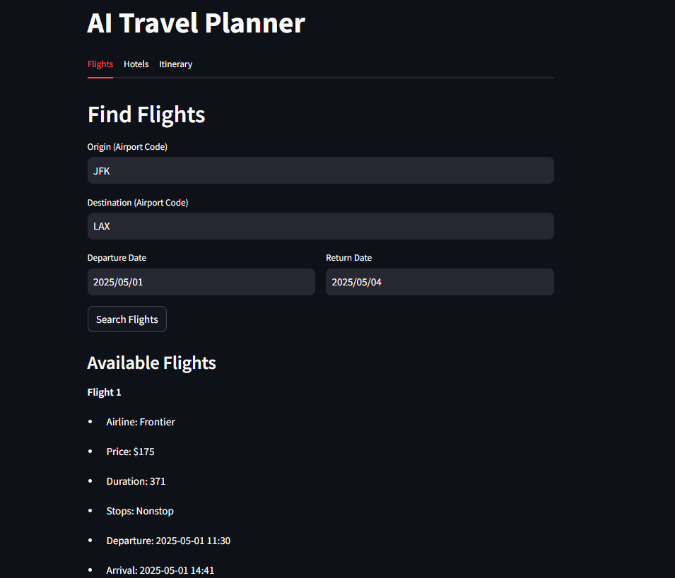

# AI Travel Planner

A comprehensive travel planning system powered by multiple AI agents, Gemini LLM, and CrewAI to help users find flights, hotels, and create detailed travel itineraries.



## 🌟 Features

- **Intelligent Flight Search:** Retrieves real-time flight data from Google Flights and provides AI-powered recommendations based on price, duration, and convenience.
- **Smart Hotel Recommendations:** Searches for accommodations and analyzes options based on location, budget, amenities, and ratings.
- **Dynamic Itinerary Generation:** Creates personalized day-by-day travel plans with attractions, restaurants, and transportation options.
- **Multi-Agent AI System:** Leverages specialized AI agents (Flight Analyst, Hotel Analyst, Travel Planner) working together to provide intelligent recommendations.
- **User-Friendly Interface:** Clean and intuitive Streamlit UI for easy interaction with the system.

## 🛠️ Technology Stack

- **Backend:** FastAPI (Python)
- **Frontend:** Streamlit
- **AI Integration:** Google Gemini LLM
- **Multi-Agent Orchestration:** CrewAI
- **Data Sources:** SerpAPI for real-time travel data

## 📋 Prerequisites

- Python 3.8+
- Google Gemini API key
- SerpAPI key

## 🚀 Installation

1. **Clone the repository:**
   ```bash
   git clone https://github.com/uniabhi/AI-Travel-Planner.git
   cd AI-Travel-Planner
   ```

2. **Create a virtual environment:**
   ```bash
   python -m venv venv
   source venv/bin/activate  # On Windows, use: venv\Scripts\activate
   ```

3. **Install required packages:**
   ```bash
   pip install fastapi uvicorn pydantic serpapi crewai streamlit
   ```

4. **Set environment variables:**
   ```bash
   # On Linux/Mac
   export GOOGLE_API_KEY="your-gemini-api-key"
   export SERPAPI_KEY="your-serpapi-key"
   
   # On Windows
   set GOOGLE_API_KEY=your-gemini-api-key
   set SERPAPI_KEY=your-serpapi-key
   ```

## 🏃‍♂️ Running the Application

1. **Start the backend server:**
   ```bash
   python run_server.py
   ```
   This will start the FastAPI server at http://localhost:8000

2. **In a separate terminal, start the Streamlit frontend:**
   ```bash
   streamlit run travel_app.py
   ```
   This will open the UI in your default web browser at http://localhost:8501

## 💻 Usage

1. **Finding Flights:**
   - Enter origin and destination airport codes
   - Select departure and return dates
   - Click "Search Flights" to see available options and AI recommendations

2. **Finding Hotels:**
   - Enter your destination city
   - Select check-in and check-out dates
   - Click "Search Hotels" to see available options and AI recommendations

3. **Generating an Itinerary:**
   - Enter your destination
   - Specify travel dates
   - Optionally provide flight and hotel details
   - Click "Generate Itinerary" for a personalized travel plan

## 🏗️ Project Structure

```
AI-Travel-Planner/
├── run_server.py        # Backend FastAPI server
├── travel_app.py        # Streamlit frontend
├── images/              # Screenshots and images
├── requirements.txt     # Project dependencies
└── README.md            # Project documentation
```

## 🧠 How Multi-Agent AI Works

This system uses CrewAI to orchestrate multiple specialized AI agents, each powered by Google's Gemini LLM:

1. **Flight Analyst Agent**
   - Analyzes flight options based on price, duration, stops, and convenience
   - Provides detailed reasoning for recommendations

2. **Hotel Analyst Agent**
   - Evaluates accommodations based on price, rating, location, and amenities
   - Recommends the optimal hotel with detailed justification

3. **Travel Planner Agent**
   - Creates detailed day-by-day itineraries
   - Includes attractions, restaurants, and transportation information
   - Optimizes schedules for the best travel experience

These agents collaborate through the CrewAI orchestration layer to provide a seamless planning experience.

## 🌐 API Endpoints

The backend server provides the following API endpoints:

- `POST /search_flights/`: Search for flights and get AI recommendations
- `POST /search_hotels/`: Search for hotels and get AI recommendations
- `POST /generate_itinerary/`: Generate a detailed travel itinerary

## 🤝 Contributing

Contributions are welcome! Please feel free to submit a Pull Request.

## 📝 License

This project is licensed under the MIT License - see the LICENSE file for details.

## 🙏 Acknowledgements

- Google Gemini for AI capabilities
- CrewAI for multi-agent orchestration
- SerpAPI for travel data
- The developers of FastAPI and Streamlit for their excellent frameworks

---

Created with ❤️ by Abhishek Kumar
